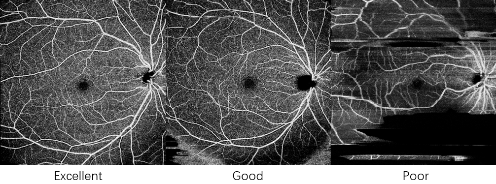

# DRAC 2022 Task 2 Image Quality Assessment

This repo covers our solution for MICCAI2022 Diabetic Retinopathy Analysis Challenge (DRAC), which solves the task of rating OCTA image quality according to poor, good and excellent.



## Dataset

Download the dataset from the official website: https://drac22.grand-challenge.org/

## Install

```
# 1. Create a conda virtual environment.
conda create -n drac python=3.9 -y
conda activate drac

# 2. Install PyTorch (We use PyTorch 2.0 built under cuda 11.8)
conda install pytorch torchvision pytorch-cuda=11.8 -c pytorch -c nvidia

# 3.
pip install timm
pip install pandas
pip install scikit-learn
pip install torchnet
```

## Folder Structure

```
.
├── checkpoints
│   ├── effb2
│   ├── incepv3
│   ├── resnet18
│   └── resnet50d
├── data
│   ├── 1. Original Images
│   │   ├── a. Training Set
│   │   └── b. Testing Set
│   ├── 2. Groundtruths
│   └── LICENSE.txt
├── dataset.py
├── main.py
├── README.md
├── results
│   ├── effb2
│   ├── incepv3
│   ├── resnet18
│   └── resnet50d
├── test_multi.py
└── test.py
```

## Train & Eval

```
python main.py --model resnet50d
```

## Test

```
python test_multi.py --model resnet50d
```

